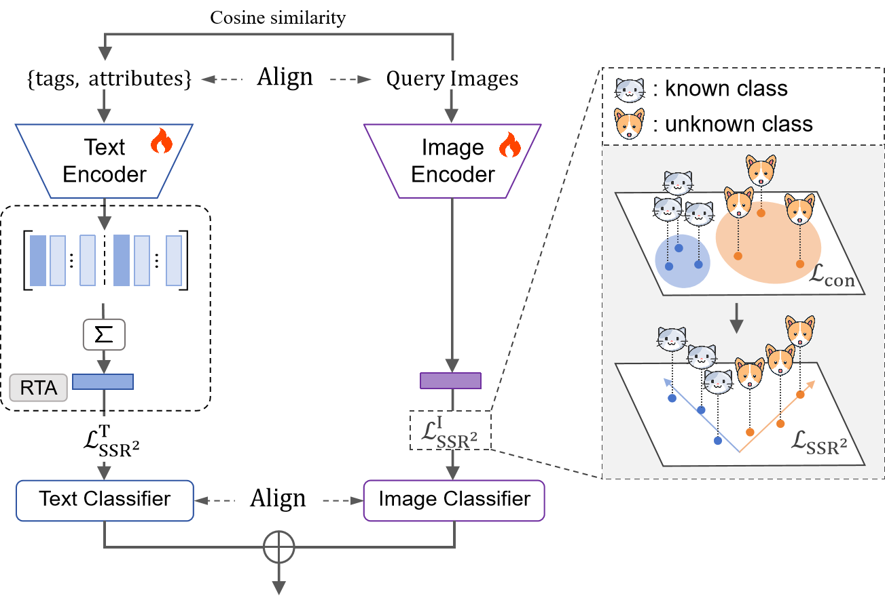

# SSR<sup>2</sup>-GCD: Semi-Supervised Rate Reduction for Multimodal GCD
<p align="center">
    
</p>

"Multi-Modal Representation Learning via Semi-Supervised Rate Reduction for Generalized Category Discovery"

<div align="center">
  
</div>

## Abstract
State-of-the-art approaches for GCD task are usually built on multi-modality representation learning, which is heavily dependent upon inter-modality alignment. However, few of them cast a proper intra-modality alignment to generate a desired underlying structure of representation distributions. In this paper, we propose a novel and effective multi-modal representation learning framework for GCD via Semi-Supervised Rate Reduction, called SSR<sup>2</sup>-GCD, to learn cross-modality representations with desired structural properties based on emphasizing to properly align intra-modality relationships. Moreover, to boost knowledge transfer, we integrate prompt candidates by leveraging the inter-modal alignment offered by Vision Language Models. We conduct extensive experiments on generic and fine-grained benchmark datasets demonstrating superior performance of our approach.

## Running

### Dependencies

```
pip install -r requirements.txt
```

### Scripts

**Train the model**:

**For a quick start, as an example, run**:
```
python prompt_search.py --dataset 'cifar10' --num_attributes 4 --num_tags 4
python main.py --dataset 'cifar10' --num_attributes 4 --num_tags 4 --base_lr 0.001
```

**or**:

```
python prompt_search.py --dataset 'flowers102' --num_attributes 4 --num_tags 4
python main.py --dataset 'cifar10' --num_attributes 4 --num_tags 4 --base_lr 0.001
```

## Acknowledgements
We follow TextGCD (https://github.com/HaiyangZheng/TextGCD) to generate the candidate pool and search prompt candidates
we acknowledge their great contribution for the multi-modal GCD community.

## Remark
Additionally, we remove prompts corresponding to **UNKNOWN** categories in the {CUB, Flowers102, Oxford Pets, Stanford Cars} datasets from the candidate pool, as these prompts may lead to semantic leakage (see the deduplicated lexicon in "./Lexicon/Lexicon_tags_deduplicated.csv", prompts from 243 categories are removed).

## License
This project is licensed under the MIT License - see the [LICENSE](LICENSE) file for details.
